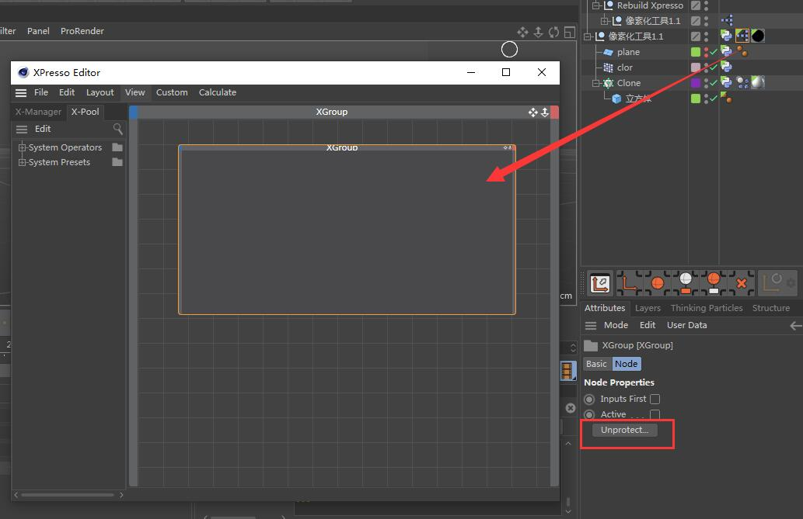

# SimpleUnlocker
Decrypt c4d xpresso nodes, show them in original style, including those under protection.

#### Coded by: [youdiaozi](https://github.com/youdiaozi)

#### Usage:
1. Copy SimpleUnlocker folder to your c4d plugins folder. The X drive is which drive you install your c4d in.
    - for c4d R19, that would be: X:\Program Files\MAXON\Cinema 4D R19\plugins\
    - for c4d R20, that would be: X:\Program Files\MAXON\Cinema 4D R20\plugins\
    - for c4d R21, that would be: X:\Program Files\Maxon Cinema 4D R21\plugins\
2. Open c4d, and open your document which needs to be handled.
    - The TestFile.c4d is supported for you. You can use it to see how this plugin works.
3. Click the menu command named **SimpleUnlocker** from the Plugins/Extensions menu. It should open a dialog name SimpleUnlocker.
    - 
4. Drag the object that you want to handle to the link control labeled **Object To Unlock** in the dialog.
    - 
5. Press the **Work** button to start. You should see that it works in a thread style. But do not do any more actions.
    - 
6. You could abort the work by press the **Abort** button any time.
7. After it finishes its work, let's check it.
    - This is the original xpresso. You can see that it's under protection.
    -  
    - This is the decrypted xpresso. All the xpresso nodes are rebuilded nicely.
    - 
8. What's more: If you are interested in python code, you can see the debug info in the console panel.
